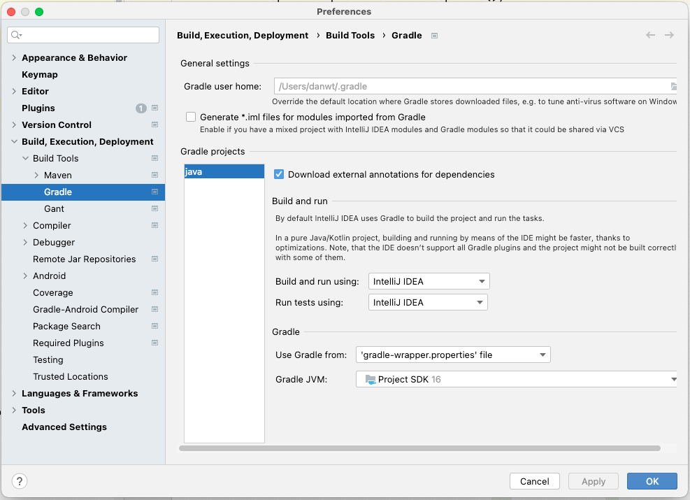

# Java Implementations

## Development

Create a new IntelliJ project from this directory and ensure the Java version being used is `16`. Ensure IntelliJ is configured to build and run and run tests using `IntelliJ IDEA`:

